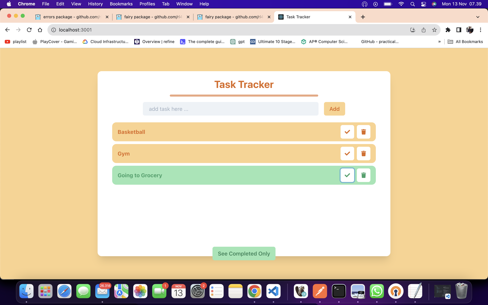
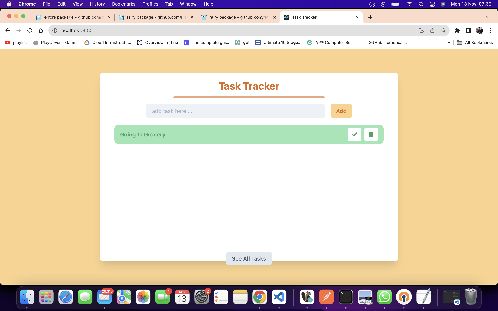

# task-tracker-vocasia

## Petunjuk Pengerjaan
1. Buatlah suatu mini app **Berbasis React** untuk menulis task harian
2. Implementasikan operasi CRUD pada task tersebut, hint: gunakan local state (useState)

   Rincian:

   - CREATE: Menambahkan task dari form
   - READ: Membaca dan me-render list of tasks
   - UPDATE: Mengubah status task menjadi complete
   - DELETE: Menghapus task

3. Buatlah UI setidaknya seperti gambar dibawah ini, bebas menggunakan CSS Utility atau framework apa saja jika membuat lebih kreatif akan menjadi nilai lebih

- Ketika form kosong, maka alert akan tampil untuk memberitahu bahwa user tidak input dengan lengkap

- Task yang sudah selesai (complete) akan berwarna berbeda dari task yang belum selesai

- Terdapat filter untuk melihat completed only tasks

## NOTES PENTING
- Lampirkan Screenshot dari fungsi-fungsi yang sudah dibuat, agar memudahkan pemeriksaan.

Happy Hacking 🔥